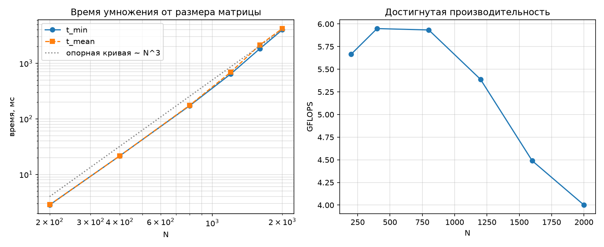

# Лабораторная 1 — Последовательное перемножение квадратных матриц (C++)

## Задание
Написать программу на C/C++ для перемножения двух квадратных матриц.
Вход: файлы со значениями исходных матриц. Выход: файл результирующей матрицы,
время выполнения, объём задачи. Обязательна автоматическая верификация
сторонним ПО (numpy).

## Сборка
```bash
cd lab01
cmake -S . -B build -DCMAKE_BUILD_TYPE=Release
cmake --build build
```

## Формат данных и ручной запуск
Файл матрицы: первая строка `rows cols`, далее элементы через пробел.
```bash
python3 scripts/generate_matrices.py --sizes 400
./build/matrix_mul --a data/A_400.txt --b data/B_400.txt --out results/C_400.txt --repeat 5
python3 scripts/verify.py --a data/A_400.txt --b data/B_400.txt --c results/C_400.txt
```

## Методика экспериментов
* размеры: 200, 400, 800, 1200, 1600, 2000;
* на каждую точку 5 измеренных повторов плюс 1 прогревочный прогон (не учитывается);
* в статистику идут t_min (наименее подвержен шуму ОС) и t_mean;
* измеряется только само умножение, без чтения/записи файлов;
* каждый результат автоматически верифицируется против numpy (`verify.py`);
* весь прогон: `python3 scripts/run_experiments.py` (таблица и график обновляются сами).

## Результаты
<!-- BENCH-TABLE-BEGIN -->
| N | t_min, ms | t_mean, ms | GFLOPS (по t_min) |
|---:|---:|---:|---:|
| 200 | 2.824 | 2.853 | 5.67 |
| 400 | 21.517 | 21.568 | 5.95 |
| 800 | 172.575 | 175.795 | 5.93 |
| 1200 | 641.336 | 692.543 | 5.39 |
| 1600 | 1824.780 | 2129.480 | 4.49 |
| 2000 | 3998.710 | 4206.060 | 4.00 |
<!-- BENCH-TABLE-END -->

Исходные данные для графика: таблица выше и `results/bench.csv`.



## Анализ результатов
* Зависимость времени кубическая: при удвоении N время растёт ≈ в 8 раз
  (200→400: 7.6×, 400→800: 8.0×); наклон на log-log графике ≈ 3.1, что совпадает
  с теоретической оценкой 2·N³ FLOP. Небольшое превышение наклона над 3 на крупных
  N объясняется выходом рабочего набора за пределы кэшей.
* Производительность немонотонна: максимум ≈ 6.0 GFLOPS при N = 400–800, когда три
  матрицы (1.2–3.7 МиБ каждая) ещё помещаются в кэш ядра; при N = 2000 рабочий набор
  91.5 МиБ лежит в оперативной памяти, и умножение становится memory-bound —
  отсюда снижение до 4.0 GFLOPS.
* Разброс t_mean относительно t_min растёт с размером (до ~15 % при N = 1600) из-за
  фонового шума ОС и троттлинга; поэтому за оценку «чистого» времени алгоритма
  взят t_min.

## Выводы
* Реализовано последовательное перемножение квадратных матриц циклами (i-k-j),
  результаты автоматически верифицированы против numpy: относительное расхождение
  ~1e-12…1e-13 при допуске 1e-7.
* Экспериментально подтверждена сложность O(N³) и получена зависимость времени
  и производительности от размера задачи (таблица и график выше).
* Выявлен переход от cache-bound к memory-bound режиму при росте N.
* Полученная последовательная версия и методика измерений служат базовой точкой
  для следующих лабораторных (распараллеливание внешнего цикла по строкам).
