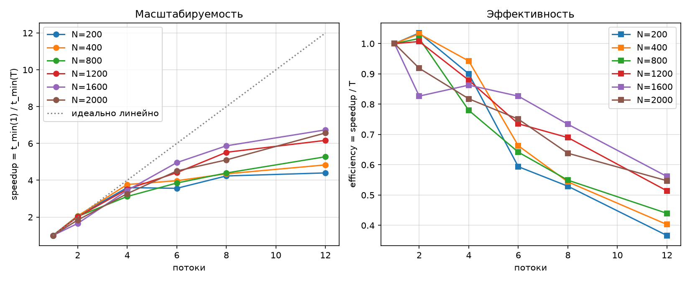

## Задание

Модифицировать программу lab01 для параллельной работы по технологии OpenMP.
Провести серию экспериментов с разным количеством потоков (1, 2, 4, 6, 8, 12),
разными размерами матриц (200…2000) и разным количеством вычислительных ядер.
Верификация результатов — автоматическая, сторонним ПО (numpy/BLAS).

## Схема параллелизации

- Технология: OpenMP (директивы компилятора + runtime), модель fork–join, общая память.
- Распараллелен внешний цикл по i (строкам матрицы C):
  `#pragma omp parallel for schedule(static)` в `multiply_parallel` (src/matrix.cpp).
- Потоки пишут в непересекающиеся строки C, матрицы A и B только читаются,
  поэтому синхронизация (critical/atomic/reduction) не требуется; порядок циклов
  i–k–j сохранён из lab01 (кэш-дружественный).
- Число потоков задаётся `--threads T` (omp_set_num_threads) или OMP_NUM_THREADS.
- Порядок сложений внутри строки не зависит от T, поэтому результат побитово
  совпадает при любом числе потоков.

## Сборка
```
cd lab02
cmake -S . -B build
cmake --build build --config Release -j
```

(OpenMP подключается через find_package(OpenMP) + цель OpenMP::OpenMP_CXX.)

## Формат данных и ручной запуск

Файл матрицы: первая строка `rows cols`, далее элементы через пробел.

python3 scripts/generate_matrices.py --sizes 400
./build/matrix_mul --a data/A_400.txt --b data/B_400.txt --out results/C_400.txt \
    --mode omp --threads 4 --repeat 5
python3 scripts/verify.py --a data/A_400.txt --b data/B_400.txt --c results/C_400.txt

## Методика экспериментов

- стенд: Intel Core i5-12400F (Alder Lake): 6 физических P-ядер, SMT → 12 логических
  процессоров; L2 = 1.25 МиБ/ядро, L3 = 18 МиБ; Windows, MSVC, сборка Release (/openmp);
- потоки: 1, 2, 4, 6, 8, 12 (по числу физических и логических процессоров стенда)

## Результаты

| N | threads | t_min, ms | GFLOPS (по t_min) | speedup | efficiency |
|---:|---:|---:|---:|---:|---:|
| 200 | 1 | 3.474 | 4.61 | 1.00 | 1.00 |
| 200 | 2 | 1.678 | 9.53 | 2.07 | 1.04 |
| 200 | 4 | 0.965 | 16.58 | 3.60 | 0.90 |
| 200 | 6 | 0.975 | 16.41 | 3.56 | 0.59 |
| 200 | 8 | 0.821 | 19.50 | 4.23 | 0.53 |
| 200 | 12 | 0.790 | 20.26 | 4.40 | 0.37 |
| 400 | 1 | 27.027 | 4.74 | 1.00 | 1.00 |
| 400 | 2 | 13.089 | 9.78 | 2.06 | 1.03 |
| 400 | 4 | 7.168 | 17.86 | 3.77 | 0.94 |
| 400 | 6 | 6.797 | 18.83 | 3.98 | 0.66 |
| 400 | 8 | 6.215 | 20.60 | 4.35 | 0.54 |
| 400 | 12 | 5.591 | 22.90 | 4.83 | 0.40 |
| 800 | 1 | 192.528 | 5.32 | 1.00 | 1.00 |
| 800 | 2 | 94.654 | 10.82 | 2.03 | 1.02 |
| 800 | 4 | 61.736 | 16.59 | 3.12 | 0.78 |
| 800 | 6 | 50.004 | 20.48 | 3.85 | 0.64 |
| 800 | 8 | 43.813 | 23.37 | 4.39 | 0.55 |
| 800 | 12 | 36.483 | 28.07 | 5.28 | 0.44 |
| 1200 | 1 | 733.425 | 4.71 | 1.00 | 1.00 |
| 1200 | 2 | 364.187 | 9.49 | 2.01 | 1.01 |
| 1200 | 4 | 208.541 | 16.57 | 3.52 | 0.88 |
| 1200 | 6 | 166.229 | 20.79 | 4.41 | 0.74 |
| 1200 | 8 | 132.895 | 26.01 | 5.52 | 0.69 |
| 1200 | 12 | 118.912 | 29.06 | 6.17 | 0.51 |
| 1600 | 1 | 2256.680 | 3.63 | 1.00 | 1.00 |
| 1600 | 2 | 1364.710 | 6.00 | 1.65 | 0.83 |
| 1600 | 4 | 653.756 | 12.53 | 3.45 | 0.86 |
| 1600 | 6 | 455.009 | 18.00 | 4.96 | 0.83 |
| 1600 | 8 | 384.408 | 21.31 | 5.87 | 0.73 |
| 1600 | 12 | 334.983 | 24.45 | 6.74 | 0.56 |
| 2000 | 1 | 4327.250 | 3.70 | 1.00 | 1.00 |
| 2000 | 2 | 2355.310 | 6.79 | 1.84 | 0.92 |
| 2000 | 4 | 1322.800 | 12.10 | 3.27 | 0.82 |
| 2000 | 6 | 960.692 | 16.65 | 4.50 | 0.75 |
| 2000 | 8 | 847.609 | 18.88 | 5.11 | 0.64 |
| 2000 | 12 | 658.723 | 24.29 | 6.57 | 0.55 |

Исходные данные: таблица выше и `results/bench.csv`.



## Анализ результатов

- Почти линейный участок до T=4: S(2) = 1.65–2.07 (E = 0.83–1.04), S(4) = 3.12–3.77
  (E = 0.78–0.94); при N ≤ 1200 эффективность на T=2 слегка выше 1 — суперлинейность
  за счёт распределения рабочего набора по приватным кэшам ядер.
- При T=6 (задействованы все 6 физических ядер) эффективность уже 0.59–0.83, т.е.
  ограничение возникает до SMT: общие L3 (18 МиБ)/пропускная способность памяти
  и снижение частоты всех ядер под общим turbo-бюджетом.
- T=12 (SMT-потоки поверх 6 ядер) даёт прирост ×1.21–1.46 к T=6, растущий с N
  (1.21 при N=400 до 1.46 при N=2000): дополнительные логические потоки скрывают
  задержки обращения к памяти, поэтому полезнее именно на крупных N. Максимальное
  ускорение S = 6.74 (N=1600, T=12) слегка превышает число физических ядер.
- E(T) монотонно падает с ростом T: E(12) = 0.37–0.56. На N=200 конфигурация T=6
  не быстрее T=4 (0.975 против 0.965 мс) — на временах ~1 мс прирост съедают
  накладные расходы создания/синхронизации команды потоков.
- Пик производительности 29.06 GFLOPS (N=1200, T=12) против 5.32 GFLOPS
  последовательной версии (N=800), ускорение по производительности ×5.5; на N=2000
  потолок 24.29 GFLOPS — рабочий набор 91.5 МиБ не помещается в кэш, режим
  memory-bound (ср. lab01).
- Воспроизводимая аномалия: (1600, T=2): S=1.65 (1.79 в контрольном прогоне) при
  соседних S(2) = 1.84–2.07 — вероятная причина размещение обоих потоков на
  SMT-паре одного ядра при отсутствии привязки (affinity); лечение —
  OMP_PROC_BIND/OMP_PLACES. За оценку времени взят t_min как наименее шумовой.
- Верификация: все 36 комбинаций N×T — OK, rel ~1e-13 при допуске 1e-7 (numpy/BLAS);
  результат побитово не зависит от T (фиксированный порядок сложений в строке).

## Выводы

- Программа lab01 модифицирована по технологии OpenMP: внешний цикл по строкам C
  распараллелен директивой `parallel for schedule(static)`; синхронизация не требуется
  благодаря непересекающейся записи потоков.
- Проведена серия экспериментов N ∈ {200…2000} × T ∈ {1, 2, 4, 6, 8, 12} на стенде
  6 физических / 12 логических ядер: максимальное ускорение S = 6.74 (N=1600, T=12),
  эффективность 0.37–1.04, производительность 5.32 → 29.06 GFLOPS.
- Экспериментально раздельно проявились три ограничителя масштабируемости: общие
  ресурсы памяти/L3 и частота (падение E уже к T=6), сублинейная надбавка SMT
  (×1.21–1.46, растёт с N за счёт скрытия задержек памяти) и оверхед fork/join на
  малых N; на малых N наблюдалась суперлинейность за счёт кэш-эффектов.
- Выявлена воспроизводимая аномалия размещения потоков без affinity-привязки;
- Корректность параллельной версии подтверждена автоматической верификацией против
  numpy для всех прогонов.
